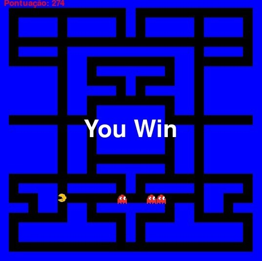

# PacMan

**Número da Lista**: 25<br>
**Conteúdo da Disciplina**: Grafos1<br>

## Alunos
|Matrícula | Aluno |
| -- | -- |
| 19/0036435  |  Pedro Henrique Carvalho Campos |
| 20/0019520  |  Hian Praxedes de Souza Oliveira |

## Sobre 

Esse projeto é uma versão do famoso jogo PAC-MAN, onde o objetivo é coletar todos os pontos do labirinto enquanto é perseguido por três fantasmas que querem te impedir de cumprir seu objetivo e sempre buscam o menor caminho para tentarem te encurralar.

Para isso, foi construído um mapa utilizando um grafo, onde cada posição no mapa é representada por um nó do grafo, e as conexões entre os nós são arestas. Dessa maneira, foi possível calcular a menor distância entre os fantasmas e o PAC-Man usando os algoritmos BFS de busca em largura.

## Screenshots
<div align="center">
	
	
	
</div>


## Instalação 
**Linguagem**: Python<br>
Para rodar esse código é necessário instalar as seguintes bibliotecas:

pygame: Biblioteca utilizada para a criação de jogos em Python. Ela é responsável pela criação de janelas, tratamento de eventos do teclado e mouse, manipulação de imagens e sons, entre outras funções.
Para instalar o pygame, é possível utilizar o gerenciador de pacotes pip, que é o instalador padrão de pacotes em Python. Basta abrir o terminal e digitar o seguinte comando:

``` shell 
pip install pygame 
``` 

## Uso 
Abra o arquivo do código em um editor de código como o VSCode, o Sublime Text, o PyCharm ou qualquer outro de sua preferência.

Execute o código com o comando:

``` shell 
python pacman.py
``` 

Aguarde até que a janela do jogo esteja aberta e divirta-se